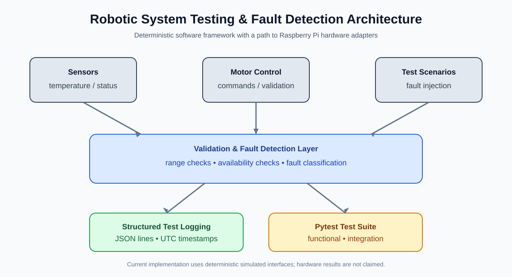

# Robotic System Testing & Fault Detection Framework


A Python-based reference framework for testing sensors, motor-control interfaces, and embedded robotic subsystems on Raspberry Pi/Linux.

> **Reference implementation:** hardware-specific I/O is represented through deterministic simulated interfaces so the framework can be executed without the original robot hardware. No physical test results are claimed.

## Project goals

- Validate sensor readings against expected ranges.
- Validate motor-control commands.
- Inject common sensor and motor faults.
- Detect and classify faults using explicit rules.
- Produce structured logs for troubleshooting.
- Separate hardware interfaces, validation, fault detection, and tests.

## System architecture



The framework separates test scenarios, sensor and motor interfaces, validation, fault detection, structured logging, and automated tests. The current implementation uses deterministic simulated interfaces; Raspberry Pi hardware adapters can be added later.

## Repository structure

```text
src/
├── sensors/
│   ├── sensor_manager.py
│   └── sensor_validator.py
├── motors/
│   ├── motor_controller.py
│   └── motor_validator.py
├── faults/
│   ├── fault_detector.py
│   └── fault_types.py
└── logging/
    └── test_logger.py
tests/
├── test_sensors.py
├── test_motor_control.py
├── test_fault_detection.py
└── test_integration.py
configs/
└── test_config.yaml
docs/
├── system_architecture.md
├── system_architecture.svg
├── test_plan.md
└── fault_scenarios.md
examples/
└── sample_test_run.py
.github/
└── workflows/
    └── tests.yml
```

## Quick start

```bash
git clone https://github.com/sohailkhadri4-design/Robotic-System-Testing-Fault-Detection-Framework.git
cd Robotic-System-Testing-Fault-Detection-Framework

python3 -m venv .venv
source .venv/bin/activate
pip install -r requirements.txt

PYTHONPATH=. python examples/sample_test_run.py
pytest -q
```

## Continuous integration

GitHub Actions runs the pytest suite automatically on pushes and pull requests targeting `main`.

The workflow:
1. Checks out the repository.
2. Sets up Python 3.11.
3. Installs project dependencies.
4. Runs `pytest -q`.

This provides an automated software-level verification step for changes to the framework.

## Fault scenarios

| Scenario | Expected detection |
|---|---|
| Sensor unavailable | `SENSOR_UNAVAILABLE` |
| Out-of-range reading | `INVALID_SENSOR_READING` |
| Invalid motor command | `MOTOR_COMMAND_INVALID` |
| Motor controller unavailable | `MOTOR_CONTROLLER_FAULT` |

## Testing approach

The framework uses deterministic simulated devices so fault conditions can be reproduced consistently through automated software tests.

The project demonstrates:

- Functional testing
- Integration testing
- Fault injection
- Structured logging
- Sensor validation
- Motor-control validation
- Troubleshooting and fault classification

## Future hardware integration

The simulated interfaces can be replaced with Raspberry Pi GPIO, I2C, SPI, PWM, and motor-driver implementations while keeping the higher-level validation and fault-detection logic.

Potential extensions:

- Hardware-in-the-loop testing
- Real sensor adapters
- Motor-driver integration
- Watchdog monitoring
- JSON test reports
- Additional CI checks

## License

This project is released under the MIT License. See [LICENSE](LICENSE).

## Author

**Syed Sohel Khadri**

Embedded Firmware | STM32 | ARM Cortex-M | Embedded C

GitHub: https://github.com/sohailkhadri4-design  
LinkedIn: https://www.linkedin.com/in/syed-sohel-khadri-7b570b381/
